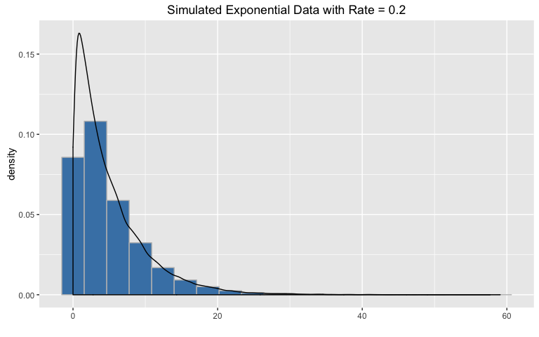

# Simulation and Analysis Project
Nicole Scott  


##Simulation

###Overview

This simulation investigates the distribution of the mean of 40 numbers drawn
from an exponential distribution with rate = 0.2.  Though the simulated data
does not follow a normal distribution, the distribution of means can be 
approximated by the normal distribution with mean = 1/rate and standard of
deviation = 1/rate.  This follows the Central Limit Theorem.

###Simulation


```r
lambda <- 0.2
sample <- rexp(40*1000, rate = lambda)
samplemat <- matrix(sample, nrow = 1000, ncol = 40)
```

This generates data points from an exponential distribution with rate lambda = 
0.2.  Data was generated for 1000 sets of 40 points and then arranged in 
a matrix with each row corresponding to one sample set.


```r
library(ggplot2)
ggplot() +
        geom_histogram(aes(sample, y = ..density..), color = "grey",
                       fill = "steelblue", bins = 20)+
        geom_density(aes(sample)) +
        xlab("") +
        ggtitle("Simulated Exponential Data with Rate = 0.2")
```

<!-- -->

This plot is a histogram of the simulated data, overlayed with a density curve.

###Sample Mean versus Theoretical Mean


```r
samplemeans <- rowMeans(samplemat)
samplemean <- round(mean(samplemeans), 3)
theorymean <- 1/lambda
ggplot()+
        geom_histogram(aes(samplemeans, y = ..density..), color = "grey", 
                       fill = "steelblue", bins = 20) +
        geom_vline(xintercept = samplemean) +
        xlab("Mean of 40 exponentials with lambda = 0.2")+
        ggtitle("Distribution of the Means of 40 Exponentials") +
        geom_density(aes(samplemeans))
```

<!-- -->

First, row means were calculated for the generated matrix to generate means of
40 samples each and stored as samplemeans.  The plot is a histogram of these 
means, with a vertical line indicating the average of the mean, rounded to 3 
decimal places(4.948), with an overlayed density curve. Theoretically 
the mean of exponential data would be 1/rate, in this case 5.  The 
difference between the sample mean (for means of 40 over 1000 simulations) and 
the theoretical mean is -0.052.

###Sample Variance versus Theoretical Variance


```r
samplesd <- round(sd(sample), 3)
meansd <- round(sd(samplemeans), 3)
theorysd <- 1/lambda
```

The standard deviation (sigma) was calculated for the means to approximate the 
variability in means of 40 exponentials. The theoretical standard deviation 
is also equal to 1/rate.  The difference between the theoretical sigma and the 
sample sigma is 0.06.  However, the difference between 
the theoretical sigma of an exponential distribution and the sigma of means of 
40 exponentials is 4.227.  (The difference between the 
variances (sigma^2) is 24.402471).  The variance of the means
is smaller than the variance of the population, following the Central Limit 
Theorem, as the distribution narrows around the population mean.


###Distribution


```r
ggplot(data.frame(sample), aes(sample)) +
        geom_histogram(aes(sample, y = ..density..), color = "grey", fill = "steelblue", position = "stack", bins = 20)+
        geom_density(aes(sample, col = "Sample Distribution")) +
        stat_function(fun = dnorm, 
                      args = list(mean = samplemean, sd = samplesd), 
                      geom = "line", aes(col = "Normal Distribution")) + 
        xlab("") +
        scale_color_manual(values = c("red", "black"), 
                           name = "") +
        ggtitle("Simulated Exponential Data with Rate = 0.2")
```

<!-- -->

This plot shows the density of the simulated data compared to a normal curve
with mean = 4.9478802 and standard of deviation = 4.9400457. The 
normal distribution does not approximate the sample population as a whole very 
well, which is logical as the samples were drawn from an exponential 
distribution, not a normal one. *As mean is a linear funciton, the mean was not
recalculated for the sample as a whole in comparison to the mean of the set of 
means.*


```r
ggplot(data.frame(samplemeans), aes(samplemeans)) +
        geom_histogram(aes(samplemeans, y = ..density..), color = "grey", 
                       fill = "steelblue", position = "stack", bins = 20) +
        geom_density(aes(samplemeans, color = "Sample Mean Distribution")) +
        stat_function(fun = dnorm, 
                      args = list(mean = samplemean, sd = meansd), 
                      geom = "line", aes(col = "Normal Distribution")) + 
        scale_color_manual(values = c("red", "black"),
                           name = "") +
        xlab("Mean") +
        ggtitle("Means of 40 Exponentials with Rate = 0.2")
```

<!-- -->

The distribution of the means of sets of 40 sampled points is much better 
approximated by the normal curve, following the central limit theorem.  

===============================================================================

##Tooth Growth Data Analysis

###Exploratory Analysis

###Data Summary

###Analysis

###Conclusions
