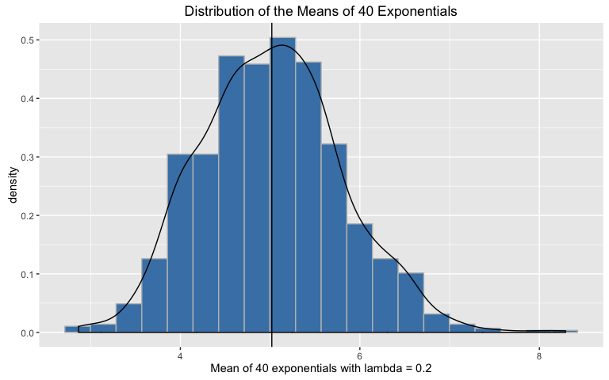
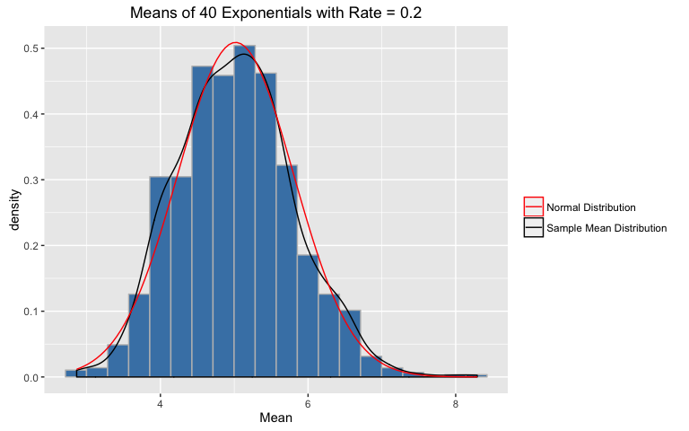

# Simulation-and-Analysis-Project


#Simulation and Data Analysis Project
Nicole Scott

##*Simulation*

##Overview

##Simulation


```r
lambda <- 0.2
sample <- rexp(40*1000, rate = lambda)
samplemat <- matrix(sample, nrow = 1000, ncol = 40)
```

This generates data points from an exponential distribution with rate lambda = 
0.2.  Data was generated for 1000 sets of 40 points and then arranged in 
a matrix with each row corresponding to one sample set.


```r
library(ggplot2)
ggplot() +
        geom_histogram(aes(sample, y = ..density..), color = "grey",
                       fill = "steelblue", bins = 20)+
        geom_density(aes(sample)) +
        xlab("") +
        ggtitle("Simulated Exponential Data with Rate = 0.2")
```

<!-- -->

This plot is a density map of all sample sets.

##Sample Mean versus Theoretical Mean


```r
samplemeans <- rowMeans(samplemat)
samplemean <- round(mean(samplemeans), 3)
theorymean <- 1/lambda
ggplot()+
        geom_histogram(aes(samplemeans, y = ..density..), color = "grey", 
                       fill = "steelblue", bins = 20) +
        geom_vline(xintercept = samplemean) +
        xlab("Mean of 40 exponentials with lambda = 0.2")+
        ggtitle("Distribution of the Means of 40 Exponentials") +
        geom_density(aes(samplemeans))
```

<!-- -->

First, row means were calculated for the generated matrix to generate means of
40 samples each and stored as samplemeans.  The plot is a histogram of these 
means, with a vertical line indicating the average of the mean, rounded to 3 
decimal places(5.018). Theoretically the mean of exponential data 
would be 1/rate, in this case 5.  The difference between the sample 
mean (for means of 40 over 1000 simulations) and the theoretical mean is 
0.018.

##Sample Variance versus Theoretical Variance


```r
samplesd <- apply(samplemat, 1, sd)
meansd <- round(mean(samplesd), 3)
theorysd <- 1/lambda
ggplot()+
        geom_histogram(aes(samplesd, y = ..density..), color = "grey", 
                       fill = "steelblue", bins = 20)+
        geom_vline(xintercept = meansd) + 
        geom_density(aes(samplesd))+
        xlab("Standard of deviation of 40 exponentials with lambda = 0.2")+
        ggtitle("Distribution of the Variance of 40 Exponentials")
```

<!-- -->

First, the standard deviation (sigma) was calculated row-wise for each of the 
sets of 40 exponentials.  The plot is a histogram of these standard 
deviations with a vertical line at the mean of the test stat rounded to 3 
decimal places, 4.903.  The theoretical standard deviation is also equal 
to 1/rate.  The difference between the sample sigma and the theoretical value is 
-0.097.  The difference of the variances (sigma^2) is equal to
-0.960591.

##Distribution


```r
ggplot(data.frame(sample), aes(sample)) +
        geom_histogram(aes(sample, y = ..density..), color = "grey", fill = "steelblue", position = "stack", bins = 20)+
        geom_density(aes(sample)) +
        stat_function(fun = dnorm, 
                      args = list(mean = samplemean, sd = sd(sample)), 
                      geom = "line", col = "red") + 
        xlab("") +
        ggtitle("Simulated Exponential Data with Rate = 0.2")
```

<!-- -->


```r
ggplot(data.frame(samplemeans), aes(samplemeans)) +
        geom_histogram(aes(samplemeans, y = ..density..), color = "grey", fill = "steelblue", position = "stack", bins = 20)+
        geom_density(aes(samplemeans)) +
        stat_function(fun = dnorm, 
                      args = list(mean = samplemean, sd = sd(samplemeans)), 
                      geom = "line", col = "red") + 
        xlab("Mean") +
        ggtitle("Means of 40 Exponentials with Rate = 0.2")
```

<!-- -->


```r
ggplot(data.frame(samplesd), aes(samplesd)) +
        geom_density(aes(samplesd)) +
        stat_function(fun = dnorm, 
                      args = list(mean = meansd, sd = sd(samplesd)), 
                      geom = "line", col = "red") + 
        xlab("Standard of Deviation") +
        ggtitle("Variance of 40 Exponentials with Rate = 0.2")
```

<!-- -->

===============================================================================

##*Tooth Growth Data Analysis*

##Exploratory Analysis

##Data Summary

##Analysis

##Conclusions
